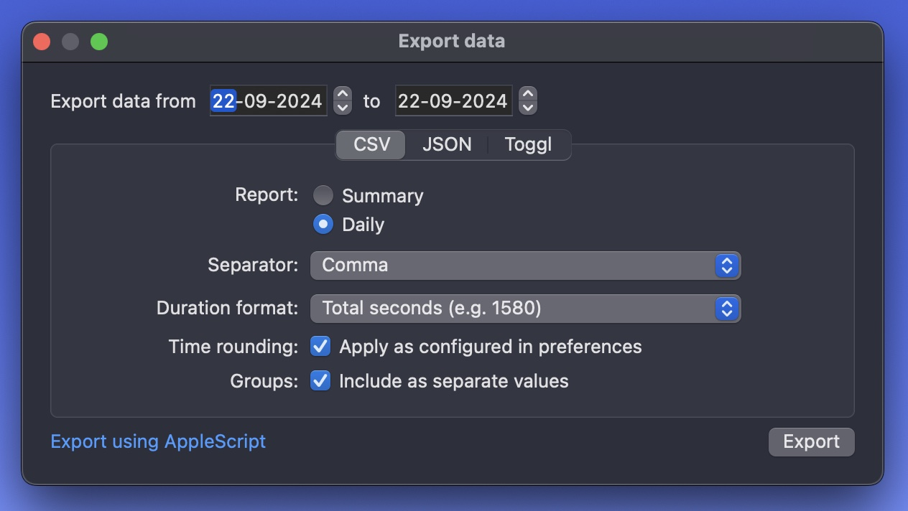

# daily-data-uploader

Upload data exported by [Daily Time Tracker](https://dailytimetracking.com/) to Supabase.

## Project Description

This script automates the process of uploading time tracking data from Daily Time Tracker to a Supabase database. It processes CSV files exported from Daily Time Tracker, parses the data, and uploads it to Supabase for further analysis and reporting.

## Requirements

- Python 3.7 or higher
- Supabase account and project
- Daily Time Tracker app

## How I run this

- Create a new virtual env: `python3 -m venv daily-uploader-env` and activate `source daily-uploader-env/bin/activate`
- Install dependencies: `pip install -r requirements.txt`
- Create a new bash file called `run-daily-uploader.sh` like this:

```bash
#!/bin/bash
export DAILY_UPLOADER_EXPORT_DIR="/your-export-path-here"
export DAILY_UPLOADER_LOG_DIR="$DAILY_UPLOADER_EXPORT_DIR/logs"
export SUPABASE_URL="https://your-project-url-here.supabase.co/"
export SUPABASE_KEY="your-key-here"
export SUPABASE_USER_EMAIL="your-email-here"
export SUPABASE_USER_PASSWORD="your-pass-here"

mkdir -p "$DAILY_UPLOADER_LOG_DIR"
source daily-uploader-env/bin/activate
/usr/bin/python3 ./app.py
deactivate
```

- Register in chron job:
  - Run: `crontab -e`
  - Add this line to run every 10 minutes:
  
  ```cron
  */10 * * * * /Users/yourusername/Documents/daily-uploader/run_daily_uploader.sh > /dev/null 2>&1
  ```

  - Verify: `crontab -l`

## How it works

- The script depends that you to manually export the data from Daily to a specific path `DAILY_UPLOADER_EXPORT_DIR`.
- You can automate this by [writing your own Apple Script](https://dailytimetracking.com/support#faq-applescript-export) and save the files to the above path. I havent tried this. I haven't tried this approach yet.
- The script will run every n minutes and process any new files created after `last_update`.
- Processed files will be moved to `/processed`.
-The script includes error handling and logging functionality. Logs are saved in the directory specified by `DAILY_UPLOADER_LOG_DIR`. Check these logs for any issues or to monitor the script's operation.

## How to export data from Daily

The script expects the CSV file to be exported using the following settings:

- You can select any time range.
- Use the export settings shown in the image below:

